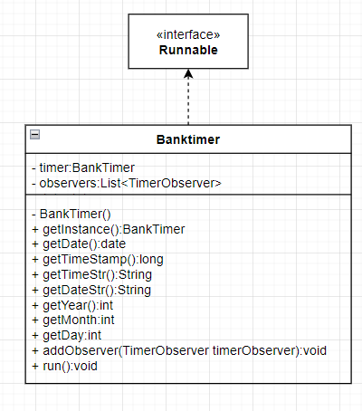
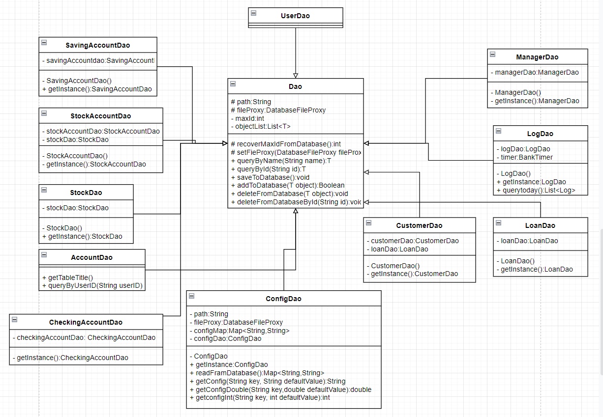
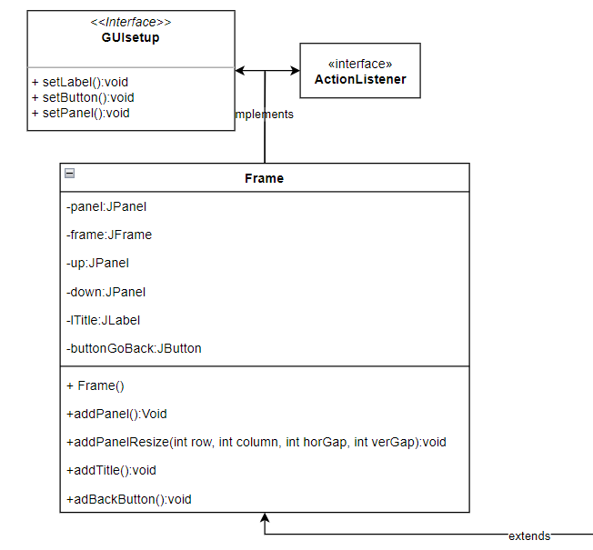
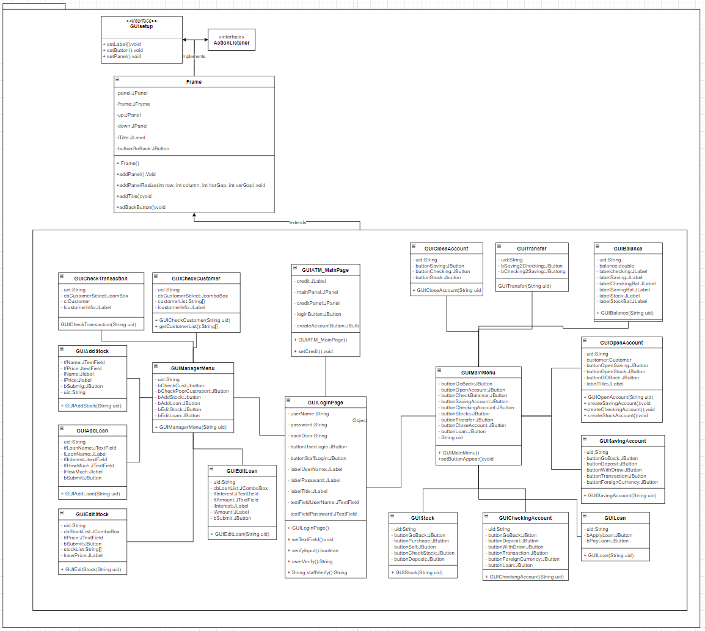
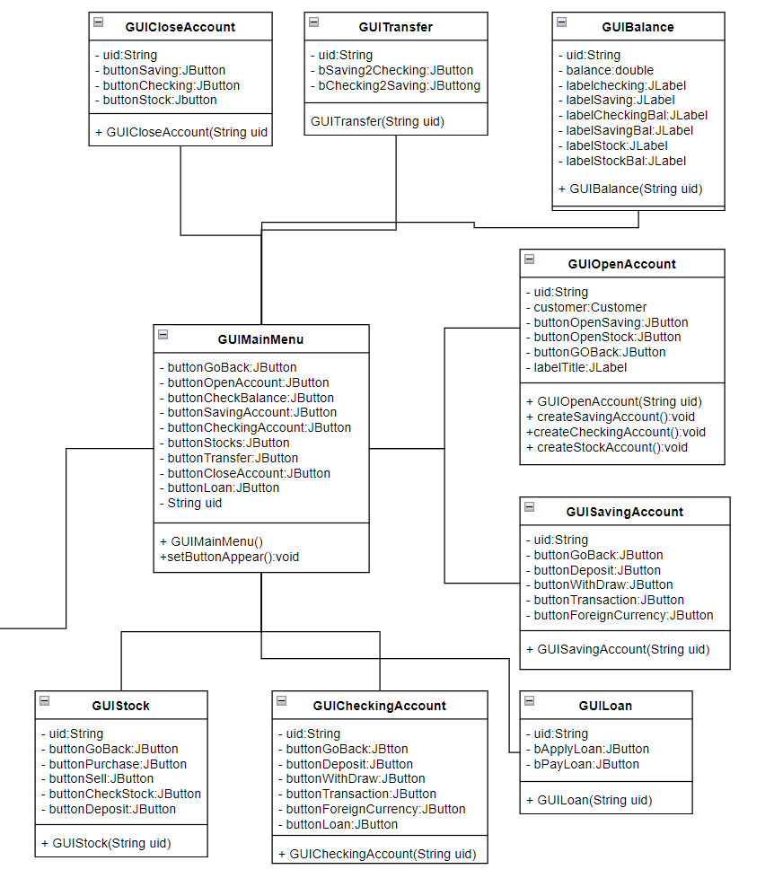
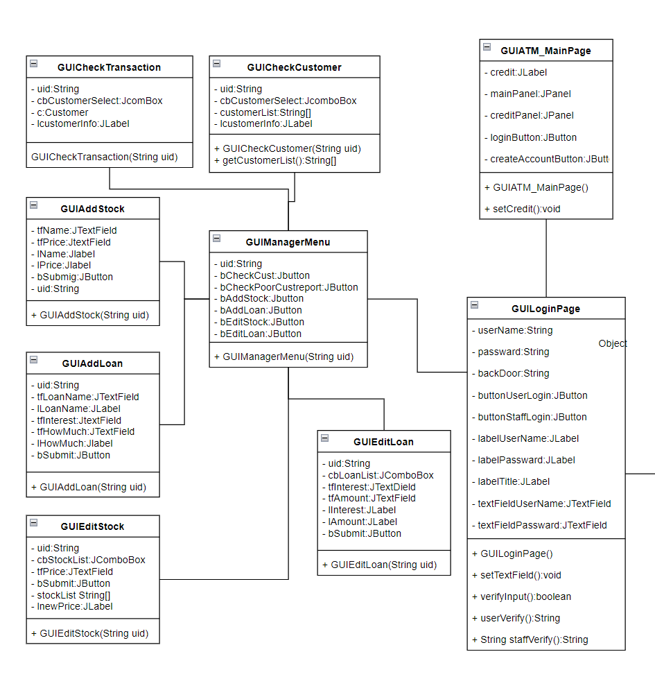

# Object Design Document


## 1. Authors

- **Hanlin Zou** (hzou7@bu.edu, U96634471)
- **Xiansong Li** (xiansong@bu.edu, U55619815)
- **Xiaohan Zou** (zxh@bu.edum, U18269004)


## 2. Overview

This software serves as a bank and offers options for users to create or login a customer or manager account. Customers can deposit and withdraw money, transfer money to one account from another, buy and sell stocks, see the transactions, etc. Managers are able to add and edit stocks and loans, check details of all users, etc.

Our persistence mechanism is implemented by storing data in CSV files. The GUI is built with java swing.


## 3. Class Description and Diagrams

We draw show the relationships between entity objects by brief description and simple class diagrams. For simplicity, we omit some of the attributes and operations of the classes.


### 3.1 Main

- **Main:** main class to initiate the program.


### 3.2 Entities

- **BankObject:** An abstract class of all objects which need to be stored in database that provided by bank, such as users, accounts, loans, stocks, etc.

  
  
  
  
  
  
- **Accounts**

  - **Account:** An abstract class of accounts in this project. Abstract of saving, checking and stock account.
  - **BasicAccount:** An abstract class of saving and checking accounts.
  - **CheckingAccount:** The class of checking accounts. Includes all features that a checking account can do. Includes but no limited: deposit, withdraw, transfer, currency exchange.
  - **StockAccount:** The class of stock accounts. Includes all features that a saving account can do. Includes but no limited: buy stock, sell stock and check profit.
  - **SavingAccount:** The class of saving accounts. Includes all features that a saving account can do. Includes but no limited: deposit, withdraw, transfer, currency exchange.

  

  
  


- **User**

  - **User:** An abstract class of cutomer and manager, should be extended bu Customer and Manager class.

  - **Manager:** The class that stands for manager of this project. Including all features that a manager can do in a bank.

  - **Customer:** The class that stands for customer of this project. Including all features that a customer can do in a bank ATM and accounts variables.


- **Others**

  - **Log:** Serves as transaction object, contains transaction ID, transaction time, transaction details, etc.
  - **Loan:** Includes all features of a loan, inherits from BankObject class.
  - **Stock:** Includes all features of a stock, inherits from BankObject class.


- **Currency**

  - **Currency:** An abstract class of currencies. Including exchange rate between all currencies and other features.

  - **CNY:** One instance of currency. Stands for Chinese Yuan.

  - **USD:** One instance of currency. Stands for US Dollar.

  - **HKD:** One instance of currency. Stands for Hong Kong Dollar.


### 3.3 Helpers

We furthur explain the mechanism and details of these classes in Section 4.

- **BankTimer:** Implements the Runnable interface, uses Singleton Pattern and Observer Pattern to help access current time.

  

- **TimeObserver:** Observer Pattern: Objects that require time (for example, objects which handle interest) should implement TimeObserver interface to receive notice when time changes.
- **DatabaseFile:** The class create a database file.
- **DatabaseFileProxy:** Uses Proxy Pattern to handle the real DatabaseFile object for avoiding creating File instance duplicate.
- **FileInterface:** Interface of DatabaseFile IO.
- **FileIo:** A static utility class for handling file IO.


### 3.4 Data Access Objects

Data Access Object (DAO) classes serve as the backend of the software. They handles all database IO operations so that other objects can access data source easily without knowing the low level details. We furthur explain the mechanism and details of classes related to database in Section 4.

  


- **Dao:** Abstract class of all other Dao classes.
- **AccountDao:** AccountDao class use Data Access Object Pattern to provide a data accessing API for saving and loading account data. It also uses Singleton Pattern to ensure it has only one instance. It's the super class of all instances of account related DAO class.
- **CheckingAccountDao:** CheckingAccountDao class use Data Access Object Pattern to provide a data accessing API for saving and loading checking account data. It also uses Singleton Pattern to ensure it has only one instance. It's the super class of all instances of checking account related DAO class.
- **ConfigDao:** ConfigDao class use Data Access Object Pattern to provide a data accessing API for saving and loading Config data. It also uses Singleton Pattern to ensure it has only one instance. It's the super class of all instances of Config related DAO class.
- **CustomerDao:** CustomerDao class use Data Access Object Pattern to provide a data accessing API for saving and loading Customer data. It also uses Singleton Pattern to ensure it has only one instance. It's the super class of all instances of Customer related DAO class.
- **LoanDao:** LoanDao class use Data Access Object Pattern to provide a data accessing API for saving and loading Loan data. It also uses Singleton Pattern to ensure it has only one instance. It's the super class of all instances of Loan related DAO class.
- **LogDao:** LogDao class use Data Access Object Pattern to provide a data accessing API for saving and loading Log data. It also uses Singleton Pattern to ensure it has only one instance. It's the super class of all instances of Log related DAO class.
- **ManagerDao:** LogDao class use Data Access Object Pattern to provide a data accessing API for saving and loading Log data. It also uses Singleton Pattern to ensure it has only one instance. It's the super class of all instances of Log related DAO class.
- **SavingAccountDao:** SavingAccountDao class use Data Access Object Pattern to provide a data accessing API for saving and loading saving account data. It also uses Singleton Pattern to ensure it has only one instance. It's the super class of all instances of saving account related DAO class.
- **StockAccountDao:** StockAccountDao class use Data Access Object Pattern to provide a data accessing API for saving and loading stock account data. It also uses Singleton Pattern to ensure it has only one instance. It's the super class of all instances of stock account related DAO class.
- **StockDao:** StockDao class use Data Access Object Pattern to provide a data accessing API for saving and loading stock data. It also uses Singleton Pattern to ensure it has only one instance. It's the super class of all instances of stock related DAO class.
- **UserDao:** UserDao class use Data Access Object Pattern to provide a data accessing API for saving and loading user data. It also uses Singleton Pattern to ensure it has only one instance. It's the super class of all instances of user related DAO class.


### 3.5 GUI

- **Frame:** Frame of the GUI. Size, color buttons etc.

  


- **GUIAddLoan:** GUI of process of manager adding a loan into database.

- **GUIAddStock:** GUI of process of manager adding a stock into database.

- **GUIATM_MainPage:** GUI of Main page when project initially launches.

- **GUIBalance:** GUI of balance page showing balance of all accounts of a customer.

- **GUICheckCustomer:** GUI of process of manager checking a specific customer's information.

- **GUICheckingAccount:** GUI of checking account with its features.

- **GUICheckTransaction:** GUI of process of manager checking a specific customer's transaction history.

- **GUICloseAccount:** GUI of process of customer close his/her account.

- **GUICreateAccount:** GUI of process of customer create a new account.

- **GUIEditLoan:** GUI of process of manager editting an existed loan.

- **GUIEditStock:** GUI of process of manager ediiting an existed stock.

- **GUIInputUtil:** GUI of pop-up windows that asks for users' inputs.

- **GUILoan:** GUI of loans.

- **GUILoginPage:** GUI of login page for user to login as customer or staff.

- **GUIMainMenu:** GUI of Main menu that displays after successful login.

- **GUIManagerMenu:** GUI of Main menu that displays after manager successful login.

- **GUIOpenAccount:** GUI of process of customer creating an account.

- **GUISavingAccount:** GUI of saving account with its features.

- **GUIsetup:** Interface file for GUI labels, buttons and panels.

- **GUIStock:** GUI of stock account pages.

- **GUITransfer:** GUI of transfer between saving and checking

  
  
  
  
  
  
  
  
  


## 4. Database and Configuration Files

### 4.1 Database

We make our data persistent by storing them in `csv` files (see `src/database/` folder):

- **Users**

  - **customers.csv:** Stores all data of all customers. Including user id, login name, login password, and loans

  - **managers:** Stores all data of all manager accounts. Including user id, login name, login password.

- **Accounts**

  - **saving_accounts.csv:** Stores all data of saving_accounts created by customers. Including saving account id, owner id, and balance of three currencies.

  - **stock_accounts.csv:** Stores all data of stock accounts created by customers. Including stock account id, owner id, balance of US Dollar, and realized and unrealized profit.

  - **checking_accounts.csv:** Stores all data of checking_accounts created by customers. Including checking account id, owner id, and balance of three currencies.

- **Other entities**

  - **loans.csv:** Stores all data of all loans created by manager. Including loan id, loan name, loan interest rate, and the value that customer can get.

  - **logs.csv:** Stores all transactions of all customers and manager. Including type, transaction id, user id, action time, action content

  - **stocks.csv:** Stores all data of stocks created by managers. Including stock id, name, and current price

For each account, we save it with the ID of user which it belongs to. In this way, when reading a user from database, we can find his or her accounts via the user ID.


### 4.2 Configuration File

We make options like exchange rate and interest rate configurable by storing them in a `csv` file (see `src/configs/config.csv`). Our code will load options from configuration file automatically. In this way, people can edit these options in the configuration file easily.


## 5. Some of the Design Patterns

### 5.1 Proxy Pattern

Class `DatabaseFile` handles file creating and fetching. While `DatabaseFileProxy` is a wrapper of the real  `DatabaseFile` object which implements additional functionality to check if the file has already been created and fetched. In this way, a client (a Data Access Object class) can can elegantly avoid creating file instance duplicately when accessing `DatabaseFile`.


### 5.2 Data Access Object Pattern

To handle database file (`csv`) IO elegantly, we uses Data Access Object pattern to provide data accessing APIs for saving and loading data without exposing details of the database. We implements a Data Access Object (DAO) class for each entity that should be saved into the database, including Stock class, Log class, Config class, Loan class, all types of User classes and all types of Account classes.


We take class `Stock`, `Manager` and `StockDao` as an example. After editting a stock, `Manager` can easily query the stock by name and save the updated stock information into the database by:

```java
public final class Manager extends User {
	// some code...
  
  public boolean adjustStockPrice(String name, double price) {
    Stock stock = stockDao.queryByName(name);  // query stock
  	// some code...
    stockDao.saveToDatabase();  // update database
    return true;
  }	
  
  // some code...
}
```

All IO operations have been encapsulated into `StockDao` class, so `Manager` doesn't need to know the details of how to save and load data to and from the database.


### 5.3 Observer Pattern

We add interest to customers' saving accounts every month and prompt customers to pay off their loans after one year. So we need a way to computing time and notice related objects (like `SavingAccount`) continually.


We implement this using Observer Pattern. We first define a `TimeObserver` interface:

```java
public interface TimerObserver {
	void onTimeChange();
	// some code...
}
```

All observers (classes that would like to receive a notice when time change, like `SavingAccount`) need to implement this interface and add itself to `BankTimer` class's observer list:

```java
public final class SavingAccount extends BasicAccount implements TimerObserver {
  // some code...
  @Override
  public void onTimeChange() {
    // ADD INTEREST! 
  }
}
```

`BankTimer` implements interface `Runnable` and override `run()` so it can run continually. It sends a notice to its observer list when time change:

```java
public class BankTimer implements Runnable {
  // some code...
  
  @Override
  public void run() {
    // some code and conditions...
    for (TimerObserver observer : observerList) {
      observer.onTimeChange();  // call its observers' onTimeChange function
      // some code...
    }
  }
}
```


### 5.4 Singleton Pattern

Every DAO class also uses Singleton Pattern to ensure it has only one instance. Here we also take `StockDao` as an example. We hide the contructor of the `StockDao` class by:

```java
public final class StockDao extends Dao<Stock> {
  private static StockDao stockDao = new StockDao();

  private StockDao() {
    // some code...
  }

  public static StockDao getInstance() {
    return stockDao;
  }
  
  // some code...
}
```

A sole instance of class `StockDao` can be obtained by:

```java
private StockDao stockDao = StockDao.getInstance();
```

`BankTimer` (a class for handling time continually) also uses Singleton Pattern, because only one `BankTimer` object is required in the whole system, of course.
